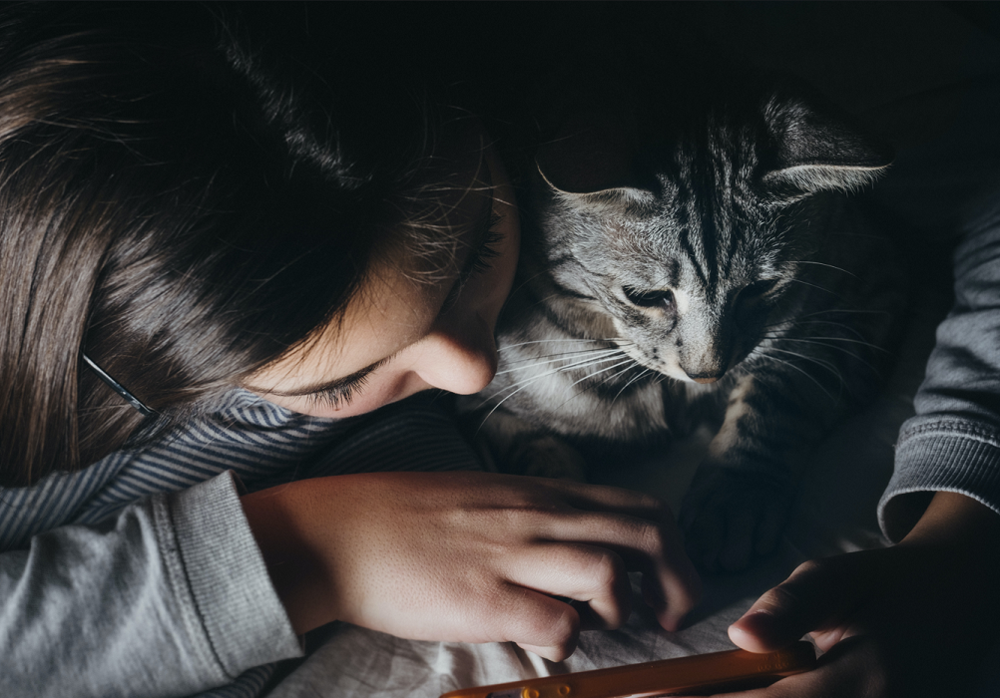

# The Big Cat Quiz

## Existing Features

### Navigation Bar

* The navigation bar sits at the top of the page, and is consistent across each page.
* The navigation bar links to the Home page, About Us page and Give Feedback page respectively, negating the need to use the browser's back button.
* The navigation bar is fully responsive and changes colour when hovered over.

### Hero Image

* The hero image is present on all three pages.
* The colour scheme of the rest of the site is based on the muted colours of the hero image.
* The image is fully responsive and resizes based on the width of the viewing device.

### Quiz Content

INFO ON QUIZ CONTENT TO GO HERE

### Footer

* The footer is consistent across all three pages and contains clickable text that will take the user to the top of the screen.
* The footer reduces the need for the user to use their scrollbar to access the navigation bar at the top of the screen.

### About Us Page

* The About Us page gives some context of the creators of the quiz, a cat charity named Feline Friends.
* The page utilises Bootstrap containers to better divide the different sections of information, providing both contact information and opening hours as well as a general 'About Us' section.

### Give Feedback Page

INFO ON GIVE FEEDBACK PAGE TO GO HERE

## Future Features

* A wider selection of quizzes, games and resources all relating to domesticated and wild cats.
* A gallery page showing the events held by the charity once these have taken place.
* Additional Google Maps API functionality to show key locations such as event venues and charity shops.

## User Experience

### Site Goals
* First Time Visitor Goals
    * As a first time visitor, I want to be able to easily navigate between pages on the site.
    * As a first time visitor, I want to be able to complete a fully functional quiz that keeps track of my score along the way.
    * As a first time visitor, I want to be able to easily restart the quiz to try and improve my score and get 10/10.
    * As a first time visitor, I want to find out more about who the quiz was created by.

* Returning Visitor Goals
    * As a returning visitor, I want to find out more about the charity and its values.
    * As a returning visitor, I want to find new content such as new quizzes and event information (future features).

 * Frequent Visitor Goals
    * As a frequent visitor, I want easy access to the charity's social media links to keep up-to-date with the latest updates and events.
    * As a first time visitor, I want to be able to provide feedback and get in touch with the charity to advise on what I feel is working and what I'd like to see added to the site.

## Design

### Colour Scheme

I have used a black and grey colour scheme in keeping with the hero image, to retain a simplistic design.

### Typography

* I have used the font Poppins, imported from Google Fonts.
* I hav used a fallback font of Sans-Serif in the case of importing errors.

### Imagery

* I have used a hero image from Unsplash showing a girl and her silver tabby cat looking at a phone, implied to be completing the quiz together.
* The rest of the site's colours are based on the muted colours in this image.

### Wireframes

WIREFRAMES TO GO HERE

## Testing Features

| Feature | Expectation | Action | Result |
| ------- | -------- | ------- | -------|
| Navigation bar links | Expectation here | Action here | Result here |
| Navigation bar hover | Expectation here | Action here | Result here |
| Footer link | Expectation here | Action here | Result here |
| Footer hover | Expectation here | Action here | Result here |
| Quiz answer selection | When an answer is selected, the score updates and the next question is shown. | Clicked on an answer in the quiz. | Result here |
| Quiz completion | When all the questions have been answered, the user receives a response based on the amount answered correctly. | Answered all questions in the quiz. | Result here |
| Feedback form | You are able to fill in the form and submit. | Filled in the feedback form with text and cliked on Submit. | Result here |

## Testing User Stories

### First Time Visitor Goals & Solutions

### Returning Visitor Goals & Solutions

### Frequent Visitor Goals & Solutions

## Device Responsiveness

### Homepage tested on:
* Laptop preview goes here
* Tablet preview goes here
* Phone preview goes here

### About Us page tested on:
* Laptop preview goes here
* Tablet preview goes here
* Phone preview goes here

### Give Feedback page tested on:
* Laptop preview goes here
* Tablet preview goes here
* Phone preview goes here

## Validator Testing

* HTML
* CSS
* JavaScript

## Lighthouse Testing

* Lighthouse testing goes here

## Debugging

* Debugging goes here

## Credit

### Images

* Hero image credit

### Languages Used

### Frameworks, Libraries & Programmes Used
[GitHub](https://github.com/) was used to store the project code after being pushed to Git via GitHub Pages.
* [Bootstrap v5.3](https://getbootstrap.com/docs/5.3/getting-started/introduction/) was used to style the site, particularly the containers in the About Us page, and the general responsiveness of the site across different devices.
* [Google Fonts](https://fonts.google.com/) was used to import the 'Poppins' font into the style.css file which is used throughout the entire website.
* [Font Awesome](https://fontawesome.com/) was used to import social media icons into the About Us page.
* [Balsamiq](https://balsamiq.com/) was used to create the wireframes for the site.
* [Lighthouse](https://chrome.google.com/webstore/detail/lighthouse/blipmdconlkpinefehnmjammfjpmpbjk?hl=en) was used to test performance, accessibility, best practise and SEO of the website.

## Deployment
### Deploying my own Project
1. I logged into GitHub and clicked on my profile picture.
2. I clicked on Your Repositories.
3. I clicked on the specific repository.
4. I then clicked Settings in the list of headers, next to Insights.
5. From there I clicked on Pages.
6. In the Pages section, in the Source subsection, I selected 'Deploy from a branch' in the first drop-down.
7. In the Branch subsection, I selected the drop-down called 'None' and changed this to 'Main'.
8. I clicked Save and refreshed the page to find the live link to my deployed site at the top of the page.

### Deploying Another User's Project
1. Log into GitHub and locate the specific Repository.
2. Click on Settings in the list of headers, next to Insights.
3. Click on Pages.
4. In the Pages section, in the Source subsection, change the drop-down selected as 'None' to 'Main'.
5. Refresh the page to find the live link to the deployed site.