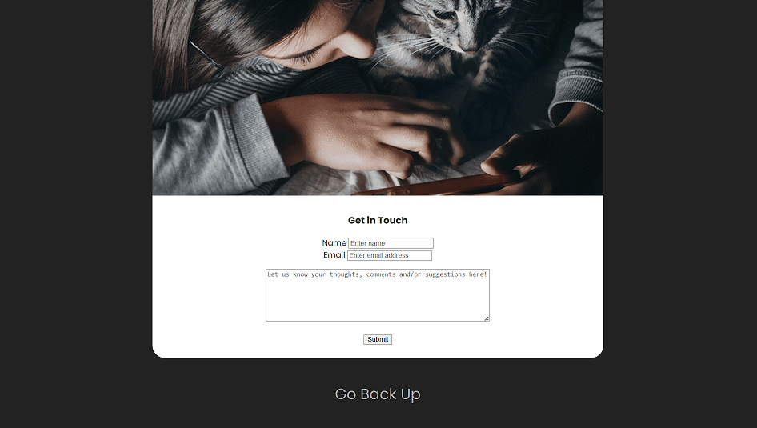

# The Big Cat Quiz

[See the live website!](https://emilygsmith.github.io/cat-quiz-project-2/)

## About the Site

I wanted to continue the theme of cat-related projects and create a quiz revolving around my favourite animal, the humble feline.

* There are ten questions ranging in difficulty, and the user is able to keep track of the score and try again once the quiz is over to try and get the full 10/10 score.

* Aside from the quiz on the main page, there is also an About Us page for the fictional charity behind the quiz, Feline Friends, and an additional page to get in touch.

* There are future plans for the site to incorporate further quizzes, games and information on community events held by the charity to raise money for the cats in their care.

## Existing Features

### Navigation Bar

* The navigation bar sits at the top of the page, and is consistent across each page.
* The navigation bar links to the Home page, About Us page and Give Feedback page respectively, negating the need to use the browser's back button.
* The navigation bar is fully responsive and changes colour when hovered over.

### Hero Image

* The hero image is present on all three pages.
* The colour scheme of the rest of the site is based on the muted colours of the hero image.
* The image is fully responsive and resizes based on the width of the viewing device.

### Quiz Questions & Answers

* The quiz has been coded using JavaScript, and consists of 10 questions presented with a greyscale colour palette.
* The options change colour when hovered over.
* Once the user has clicked on an answer, the next question generates, hiding the previous question.
* The score container underneath the main quiz content increases by 1 if a question is answered correctly, otherwise it remains the same.

### Quiz Score Container

* The score in the score container underneath the main quiz content increases by 1 if a question is answered correctly.
* If a question is answered incorrectly the score in the score container will remain the same.

### Quiz Completion

* Upon answering all ten questions, the user will receive one of three result messages dependent on whether they answered 1-3, 4-7 or 8-10 questions correctly.
* A Reset Quiz button will appear underneath the result message, and if the user clicks, this will reset the quiz.
* Once the quiz is reset it will take the user back to the first question and the score container will be set back to zero.

### Footer

* The footer is consistent across all three pages and contains clickable text that will take the user to the top of the screen.
* The footer reduces the need for the user to use their scrollbar to access the navigation bar at the top of the screen.

### About Us Page

* The About Us page gives some context of the creators of the quiz, a cat charity named Feline Friends.
* The page utilises Bootstrap containers to better divide the different sections of information, providing both contact information and opening hours as well as a general 'About Us' section.
* There are FontAwesome social media icons at the bottom of the page to take the user to the charity's respective social media pages.

### Give Feedback Page

* The Feedback page includes a form which allows the user to enter their name/contact email address and any comments or requests they wish to pass on.
* The user can enter their name, email address and any relevant comments and click the submit button.

## Future Features

* A wider selection of quizzes, games and resources all relating to domesticated and wild cats.
* A gallery page showing the events held by the charity once these have taken place.
* Additional Google Maps API functionality to show key locations such as event venues and charity shops.

## User Experience

### Site Goals
* First Time Visitor Goals
    * As a first time visitor, I want to be able to easily navigate between pages on the site.
    * As a first time visitor, I want to be able to complete a fully functional quiz that keeps track of my score along the way.
    * As a first time visitor, I want to be able to easily restart the quiz to try and improve my score and get 10/10.
    * As a first time visitor, I want to find out more about who the quiz was created by.

* Returning Visitor Goals
    * As a returning visitor, I want to find out more about the charity and its values.
    * As a returning visitor, I want to find new content such as new quizzes and event information (future features).

 * Frequent Visitor Goals
    * As a frequent visitor, I want easy access to the charity's social media links to keep up-to-date with the latest updates and events.
    * As a first time visitor, I want to be able to provide feedback and get in touch with the charity to advise on what I feel is working and what I'd like to see added to the site.

## Design

### Colour Scheme

I have used a black and grey colour scheme in keeping with the hero image, to retain a simplistic design.

### Typography

* I have used the font Poppins, imported from Google Fonts.
* I hav used a fallback font of Sans-Serif in the case of importing errors.

### Imagery

* I have used a hero image from Unsplash showing a girl and her silver tabby cat looking at a phone, implied to be completing the quiz together.
* The rest of the site's colours are based on the muted colours in this image.

### Wireframes - Homepage

* [Home - Laptop](assets/images/wireframe-home-laptop.png)
* [Home - Tablet](assets/images/wireframe-home-tablet.png)
* [Home - Phone](assets/images/wireframe-home-phone.png)

### Wireframes - About Us Page
* [About - Laptop](assets/images/wireframe-about-laptop.png)
* [About - Tablet](assets/images/wireframe-about-tablet.png)
* [About - Phone](assets/images/wireframe-about-phone.png)

### Wireframes - Give Feedback Page
* [Feedback - Laptop](assets/images/wireframe-feedback-laptop.png)
* [Feedback - Tablet](assets/images/wireframe-feedback-tablet.png)
* [Feedback - Phone](assets/images/wireframe-feedback-phone.png)

## Testing Features

| Feature | Expectation | Action | Result |
| ------- | -------- | ------- | -------|
| Navigation bar links | When the user clicks on a navigation link in the nav bar, they will be taken to that named page. | Clicked on Home, About Us page and Give Feedback page respectively. | Directed to the correct page each time. |
| Navigation bar hover | When the user hovers over a link in the nav bar, it will change to a lighter colour. | Hovered over each clickable link on each page. | Each clickable link changed to a lighter colour when hovered over. |
| Footer link | When the 'Go Back Up' link is clicked, the user will be taken to the top of the page. | Clicked on 'Go Back Up' link on each page. | The user is taken to the top of the page each time the footer link is clicked. |
| Footer hover | When the user hovers over the footer link, it will change to a lighter colour. | Hovered over the footer link on each page. | The footer link chagned to a lighter colour when hovered over on each page. |
| Quiz answer selection | When an answer is selected, the score updates and the next question is shown. | Answered all ten questions in the quiz. | Each time a question was answered, the next question would appear and hide the previous question, and the score would increment by 1 if correct. |
| Quiz completion | When all the questions have been answered, the user receives a response based on the amount answered correctly. | Answered all questions in the quiz, getting one question right, six questions right and nine questions right respectively. | The appropriate result quote was relayed each time based on the amount of questions answered correctly. |
| Feedback form | You are able to fill in the form and submit. | Filled in the feedback form with text and cliked on Submit. | The information was submitted. |
| Social media icons | Clicking on each icon will take you to the respective social media site. | Clicked on each icon. | The user is successfully directed to the appropriate site by clikcing on the correlating icon. | 

## Testing User Stories

### First Time Visitor Goals & Solutions

* As a first time visitor, I want to be able to easily navigate between pages on the site.
    * There is a navigation bar in relatively large font situated at the top of each page for easy navigation throughout the site.
    * Depending on what page the user is currently visiting, the page you are visiting will be greyed out, and the two links to the other two respective pages will be clickable.
* As a first time visitor, I want to be able to complete a fully functional quiz that keeps track of my score along the way.
    * The quiz on the site is fully functional and has a score container that keeps track of your score throughout.
    * The score container resets along with the questions when the user clicks on the 'Reset Quiz' button.
* As a first time visitor, I want to be able to easily restart the quiz to try and improve my score and get 10/10.
    * There is a 'Reset Quiz' button the user can click on once they have answered all ten questions the first time around.
    * This will reset both the questions and the score in the score container which will return to 0 and increment again as normal when questions are answered correctly.
* As a first time visitor, I want to find out more about who the quiz was created by.
    * There is a direct link in the navigation bar to the 'About Us' page which gives information on the charity who have created the website.
    * The About Us page includes a brief overview, contact information and opening hours of the charity.

### Returning Visitor Goals & Solutions
* As a returning visitor, I want to find out more about the charity and its values.
    * The About Us page includes information about the charity, its mission, and further contact information.
* As a returning visitor, I want to find new content such as new quizzes and event information (future features).
    * New features such as extra quizzes and games, as well as a location tool via Google Maps API to show locations of the charity shops and offices in the UK, will be added in future updates.

### Frequent Visitor Goals & Solutions
* As a frequent visitor, I want easy access to the charity's social media links to keep up-to-date with the latest updates and events.
    * There are direct links to the charity's social media accounts on the About Us section.
    * Each link is clickable via respective FontAwesome icons.
* As a first time visitor, I want to be able to provide feedback and get in touch with the charity to advise on what I feel is working and what I'd like to see added to the site.
    * There is a direct link in the navigation bar to the Give Feedback page.
    * The Give Feedback page includes a form where the user can provide their contact details and feedback for the charity to look into and respond where appropriate.

## Device Responsiveness

### Homepage tested on:
* 15" Dell Laptop - [top of screen](assets/images/site-preview-15-laptop-top.png) and [bottom of screen](assets/images/site-preview-15-laptop-bottom.png)
* [Surface Pro 7 tablet](assets/images/site-preview-tablet)
* [iPhone SE](assets/images/site-preview-iphone-se.png)
* [Samsung Galaxy S8+](assets/images/site-preview-samsung-phone.png)

### About Us page tested on:
* [15" Dell Laptop](assets/images/about-preview-laptop.png)
* [Surface Pro 7 tablet](assets/images/about-preview-tablet.png)
* [iPhone SE](assets/images/about-preview-iphone-se.png)
* [Samsung Galaxy S8+](assets/images/about-preview-samsung-phone.png)

### Give Feedback page tested on:
* [15" Dell Laptop](assets/images/feedback-preview-laptop.png)
* [Surface Pro 7 tablet](assets/images/feedback-preview-tablet.png)
* [iPhone SE](assets/images/feedback-preview-iphone-se.png)
* [Samsung Galaxy S8+](assets/images/feedback-preview-samsung-phone.png)

## Validator Testing

* [HTML - Homepage](assets/images/validator-html-index.png)
* [HTML - About](assets/images/validator-html-about.png)
* [HTML - Feedback](assets/images/validator-html-feedback.png)
* [CSS](assets/images/validator-css.png)
* [JavaScript](assets/images/validator-js.png)

## Lighthouse Testing

* Lighthouse testing goes here

## Debugging

* CSS Validator initally returned errors with an unclosed div tag and unnecessary closing break tag. I added the additional div and removed the closing break tag, re-ran the validator test, and all was returned OK.

## Credit

### Images

* Hero image from [Unsplash](https://unsplash.com/photos/lz_VB9yEc_c)

### Languages Used
* [HTML5](https://en.wikipedia.org/wiki/HTML5)
* [CSS3](https://en.wikipedia.org/wiki/CSS)
* [JavaScript](https://en.wikipedia.org/wiki/JavaScript)

### Frameworks, Libraries & Programmes Used
* [GitHub](https://github.com/) was used to store the project code after being pushed to Git via GitHub Pages.
* [Unsplash](https://www.unsplash.com/) was used to locate and display a hero image on the site across all three pages.
* [Bootstrap v5.3](https://getbootstrap.com/docs/5.3/getting-started/introduction/) was used to style the site, particularly the containers in the About Us page, and the general responsiveness of the site across different devices.
* [Google Fonts](https://fonts.google.com/) was used to import the 'Poppins' font into the style.css file which is used throughout the entire website.
* [Font Awesome](https://fontawesome.com/) was used to import social media icons into the About Us page.
* [Balsamiq](https://balsamiq.com/) was used to create the wireframes for the site.
* [Lighthouse](https://chrome.google.com/webstore/detail/lighthouse/blipmdconlkpinefehnmjammfjpmpbjk?hl=en) was used to test performance, accessibility, best practise and SEO of the website.

## Deployment
### Deploying my own Project
1. I logged into GitHub and clicked on my profile picture.
2. I clicked on Your Repositories.
3. I clicked on the specific repository.
4. I then clicked Settings in the list of headers, next to Insights.
5. From there I clicked on Pages.
6. In the Pages section, in the Source subsection, I selected 'Deploy from a branch' in the first drop-down.
7. In the Branch subsection, I selected the drop-down called 'None' and changed this to 'Main'.
8. I clicked Save and refreshed the page to find the live link to my deployed site at the top of the page.

### Deploying Another User's Project
1. Log into GitHub and locate the specific Repository.
2. Click on Settings in the list of headers, next to Insights.
3. Click on Pages.
4. In the Pages section, in the Source subsection, change the drop-down selected as 'None' to 'Main'.
5. Refresh the page to find the live link to the deployed site.